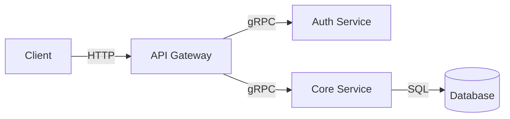

# Article Structure Templates

Structural blueprints for different project types. Select the template that best matches
the project's nature, then adapt as needed.

## Template Selection

| Project Type | Best Template | Why |
|-------------|---------------|-----|
| CLI tool | The Tool Story | Focus on workflow transformation |
| Library/SDK | The Abstraction Story | Focus on what it hides and why |
| API/Service | The Architecture Story | Focus on decisions under constraints |
| DevOps/Infra | The Automation Story | Focus on what was manual and isn't anymore |
| Data pipeline | The Scale Story | Focus on volume, throughput, reliability |
| AI/ML project | The Experiment Story | Focus on hypothesis, iteration, results |
| Side project | The Itch Story | Focus on personal pain → general solution |
| Rewrite/Refactor | The Migration Story | Focus on before/after, the bridge between |

## Template: The Tool Story

For CLI tools, developer utilities, and workflow tools.

```
HEADLINE: [Verb] + [outcome] + [constraint or surprise]
  Example: "Replacing a 2,000-Line Bash Script with 200 Lines of Go"

LEAD: The pain point as a scene. What was the workflow before?

SECTION 1: The Problem (200-300 words)
  - What was the manual/broken workflow?
  - How many people were affected?
  - What were the symptoms (not the root cause — save that for later)?

SECTION 2: The Design Decision (300-400 words)
  - Why this language/approach?
  - What alternatives were considered and rejected?
  - What constraint shaped the design most?
  - [CODE SNIPPET: The core command/function — the "verb" of the tool]

SECTION 3: The Interesting Bit (400-500 words)
  - The technically clever part
  - What a developer would learn from reading this code
  - [CODE SNIPPET: The non-obvious implementation detail]

SECTION 4: What Changed (200-300 words)
  - Concrete before/after metrics if available
  - Qualitative improvements (confidence, speed, fewer incidents)

CLOSING: Circle back to the opening scene. How does Friday at 3pm look now?
```

## Template: The Abstraction Story

For libraries, SDKs, and frameworks.

```
HEADLINE: [Domain] + [Without/Beyond] + [conventional approach]
  Example: "Type-Safe SQL Without an ORM"

LEAD: The tension between the abstraction and what it hides.

SECTION 1: The Leaky Abstraction (200-300 words)
  - What existing solutions get wrong
  - The specific pain that motivated building something new
  - NOT a takedown of other libraries — focus on the gap

SECTION 2: The API (300-400 words)
  - Show the public interface — what a user sees
  - [CODE SNIPPET: The simplest meaningful usage example]
  - Why this API shape? What tradeoffs does it encode?

SECTION 3: Under the Hood (400-500 words)
  - The implementation insight that makes the API possible
  - [CODE SNIPPET: The core mechanism — parser, transformer, runtime trick]
  - What would break if this were done the "normal" way?

SECTION 4: Tradeoffs (200-300 words)
  - What this approach can't do
  - Where it breaks down
  - What would change with a rewrite

CLOSING: The general lesson about abstractions this project teaches.
```

## Template: The Architecture Story

For APIs, services, and backend systems.

```
HEADLINE: [Building/Designing] + [system type] + [for constraint]
  Example: "Designing a Notification System for 10 Million Events per Day"

LEAD: The constraint that made this interesting (scale, latency, cost, reliability).

SECTION 1: Requirements (200-300 words)
  - What the system must do, in concrete terms
  - The constraint that rules out the obvious approach
  - Why off-the-shelf solutions didn't fit

SECTION 2: The Architecture (400-500 words)
  - High-level design — components and their relationships
  - [Use a text diagram or Mermaid if helpful]
  - The one decision that everything else follows from

SECTION 3: The Hard Part (400-500 words)
  - The component or interaction that was hardest to get right
  - [CODE SNIPPET: The tricky bit — the retry logic, the cache invalidation,
    the consistency guarantee]
  - How it was debugged or iterated on

SECTION 4: Production Reality (200-300 words)
  - What surprised after deployment
  - Performance characteristics
  - What would be different starting over

CLOSING: The architectural principle this project validated or challenged.
```

## Template: The Itch Story

For side projects and personal tools. The most natural template for portfolio pieces.

```
HEADLINE: [Problem statement as frustration] → [unexpected solution]
  Example: "I Was Tired of Copy-Pasting SQL, So I Built a Query Compiler"

LEAD: The personal itch — the moment of "there has to be a better way."

SECTION 1: The Itch (200-300 words)
  - The specific, relatable frustration
  - Why existing solutions didn't scratch it
  - The moment the project started (keep it human and honest)

SECTION 2: First Attempt (200-300 words)
  - The naive approach and why it fell short
  - What was learned from it
  - The pivot to the current approach

SECTION 3: The Solution (400-500 words)
  - What the project actually does now
  - [CODE SNIPPET: The core logic that makes it work]
  - The "aha moment" during development

SECTION 4: What I'd Do Differently (200-300 words)
  - Honest reflection — over-engineering, wrong abstractions, missing tests
  - What was learned about the domain

CLOSING: Whether the itch is scratched. A sentence about what's next, or why
  nothing is next.
```

## Template: The Migration Story

For rewrites, refactors, and platform migrations.

```
HEADLINE: [Migration verb] + [from] → [to] + [outcome]
  Example: "Moving 50 Microservices Back to a Monolith — and Why It Worked"

LEAD: The counterintuitive result or the moment the migration was decided.

SECTION 1: The Before (300-400 words)
  - What the old system looked like
  - Why it needed to change (performance, maintainability, cost, team size)
  - What triggered the decision to migrate NOW

SECTION 2: The Strategy (300-400 words)
  - How to migrate without stopping the world
  - The bridge pattern, the strangler fig, the dual-write — whatever was used
  - [CODE SNIPPET: The adapter/bridge that connected old and new]

SECTION 3: The Hardest Part (300-400 words)
  - The thing that almost killed the migration
  - [CODE SNIPPET: The gnarliest compatibility layer or data transformation]
  - How it was resolved

SECTION 4: The After (200-300 words)
  - Concrete improvements (performance, developer velocity, cost)
  - What was lost in the migration
  - Whether it was worth it (be honest)

CLOSING: The lesson about when to migrate and when to stay.
```

## Section Flow Principles

Regardless of template:

1. **Open with tension, not context.** Context is background — deliver it after the hook.
2. **Alternate between narrative and technical.** Never stack more than two technical
   paragraphs without a narrative beat.
3. **Escalate complexity.** Start with the accessible overview, drill into the hard
   parts in the middle, zoom back out at the end.
4. **Every section must advance the story.** If a section could be removed without the
   article losing coherence, remove it.

## Length Guidance

| Project Complexity | Target Word Count | Sections |
|-------------------|-------------------|----------|
| Small tool / utility | 1,200–1,800 | 3–4 |
| Medium project | 1,800–2,500 | 4–5 |
| Large system / migration | 2,500–3,500 | 5–6 |

Err on the side of shorter. A tight 1,500-word article beats a padded 3,000-word one.

## Mermaid Diagrams

For architecture and data flow projects, a Mermaid diagram can replace 200 words of
description. Use when:

- The system has 3+ interacting components
- Data flows through multiple stages
- The relationships aren't linear

Keep diagrams simple — 5-8 nodes maximum. Label edges with verbs.



Do NOT use diagrams when the system is simple enough to describe in a sentence.
