# Diagrams Catalog

Everything the agent can use to illustrate slides. Organized by render path:

1. **Mermaid native** — rendered by Marp directly from fenced code blocks. Works in HTML, PDF, PPTX (as images).
2. **PNG via scripts** — generated by `scripts/make_chart.py` or other helpers, referenced as images.
3. **HTML embeds** — interactive charts via `<canvas>`/`<script>`. Work in HTML output ONLY; do not export to PPTX.
4. **External imports** — images created in Excalidraw/draw.io/Figma, imported as PNG/SVG.
5. **ASCII** — quick-and-dirty text diagrams inside code blocks.

---

## 1. Mermaid native (zero setup)

All 18 diagram types below work inside a fenced code block with `mermaid` language.

### Flowchart
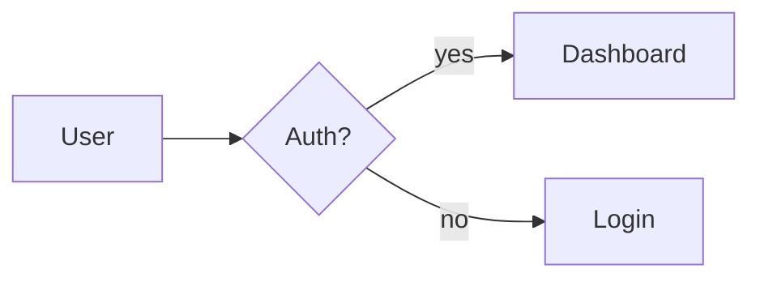
**Use for**: process flows, decision trees, high-level pipelines. The workhorse.

### Sequence diagram
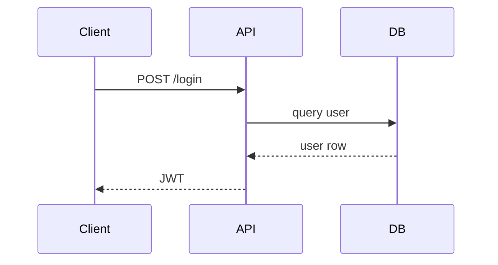
**Use for**: API calls, protocols, temporal flows, auth exchanges.

### State diagram
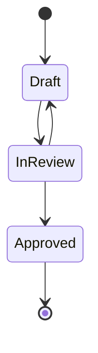
**Use for**: FSMs, lifecycle states, feature flag rollouts, order status.

### ER diagram
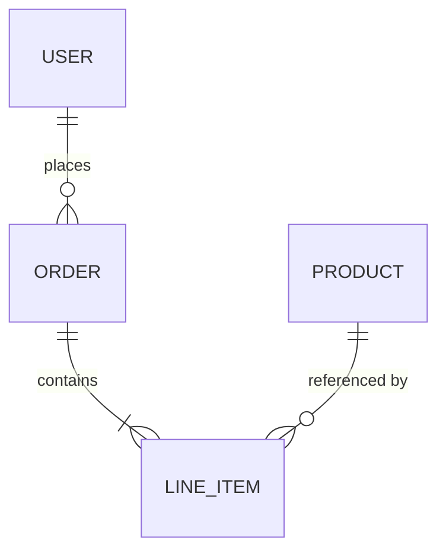
**Use for**: database schemas, data-model explanations.

### Class diagram
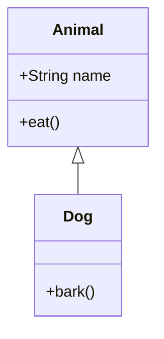
**Use for**: OOP hierarchies, service class structure, type relationships.

### C4 diagrams (architecture gold)
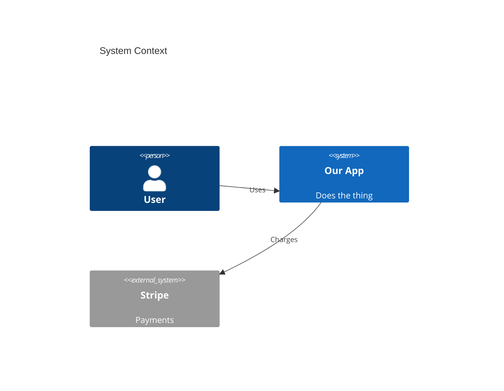

Variants: `C4Context`, `C4Container`, `C4Component`, `C4Dynamic`, `C4Deployment`.

**Use for**: system architecture at the 4 C4 zoom levels. Gold for architecture mode.

### Gantt
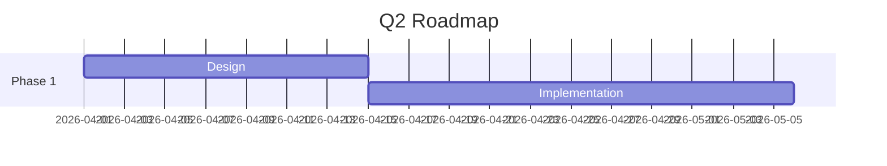
**Use for**: project timelines, release planning, dependencies.

### Pie
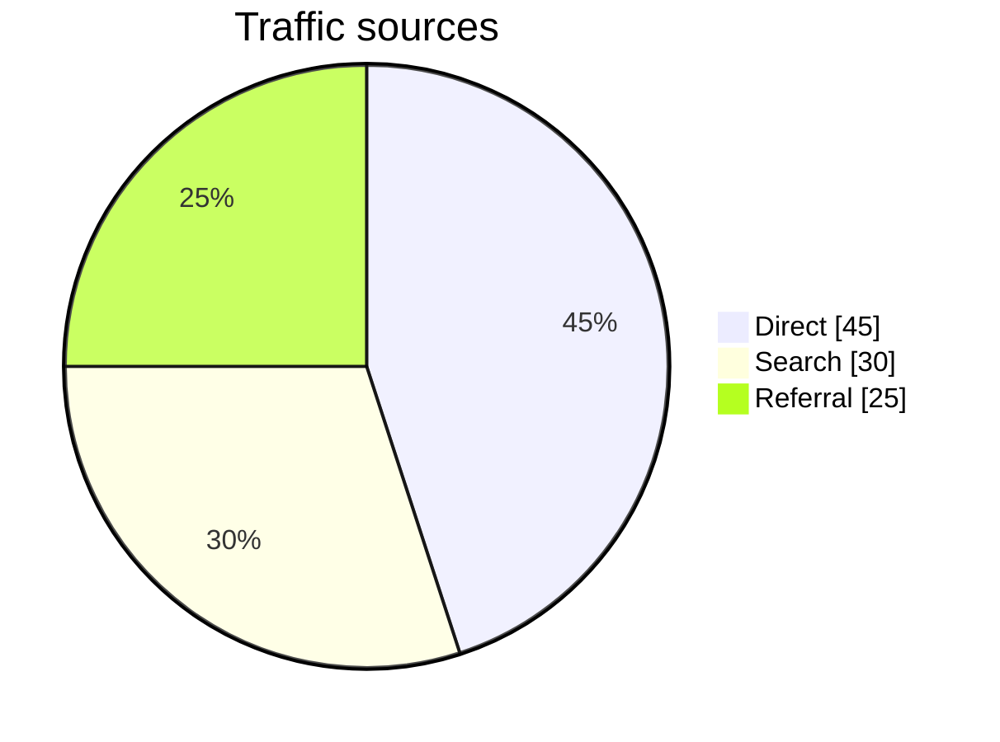
**Use for**: share-of-whole (traffic mix, revenue split).

### Git graph
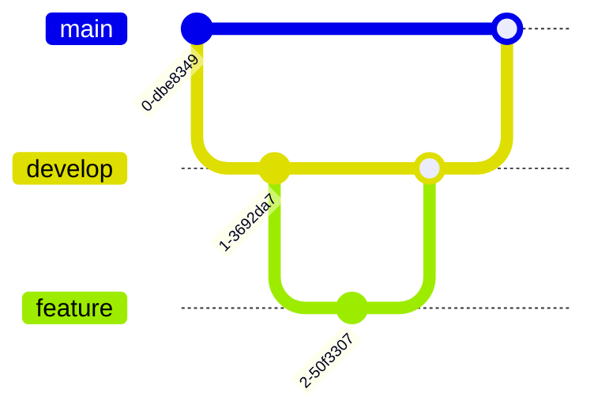
**Use for**: branching strategies, release cuts.

### Mindmap
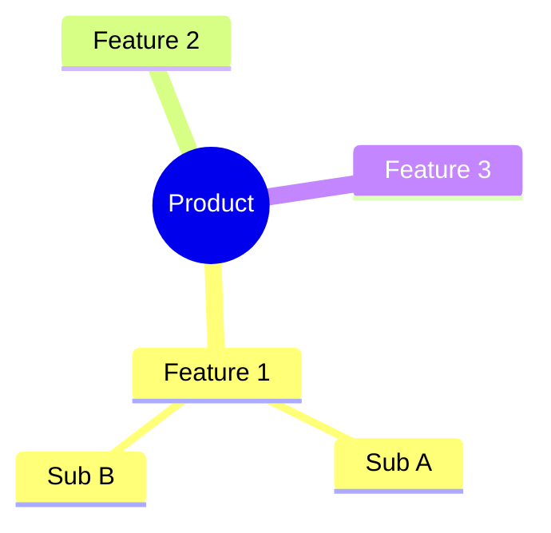
**Use for**: brainstorms, feature trees, scope decomposition.

### Timeline
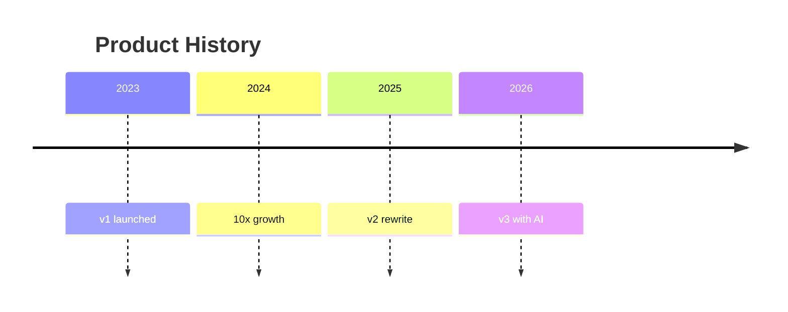
**Use for**: history slides, incident chronology, roadmap.

### Quadrant chart
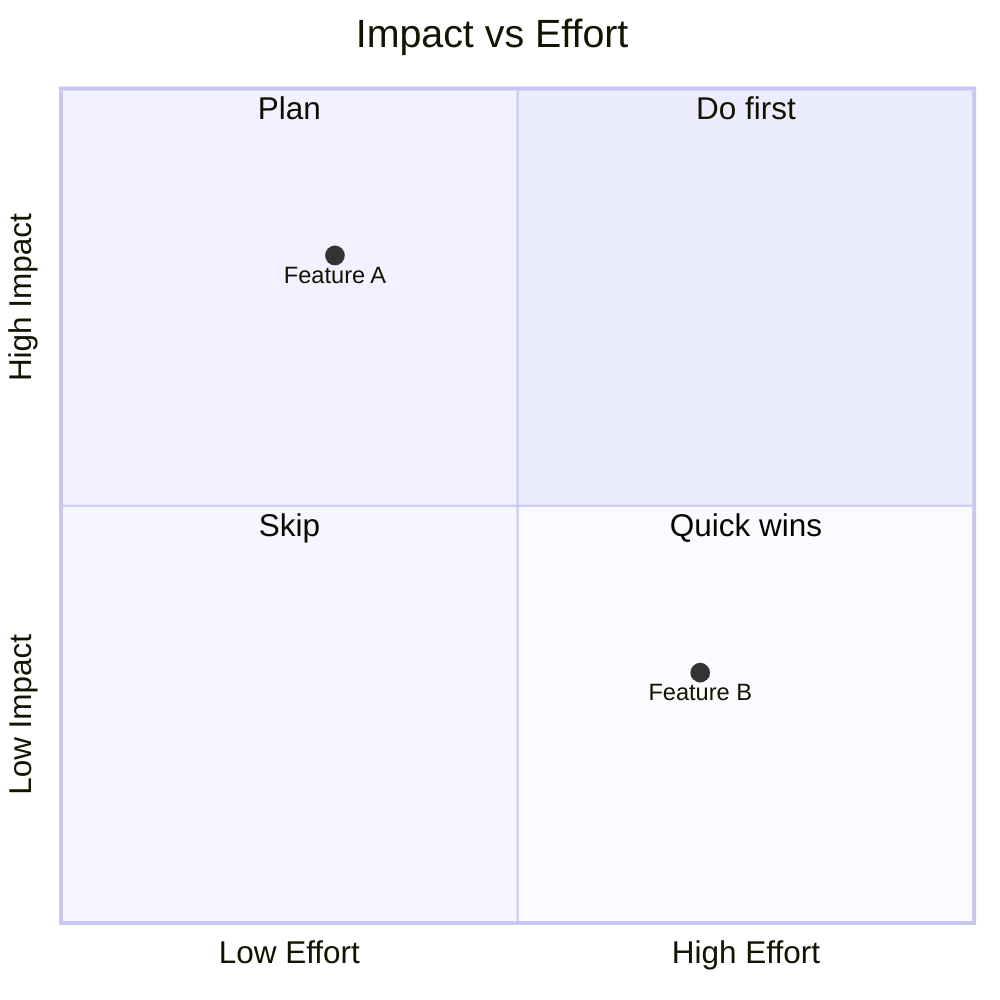
**Use for**: 2x2 prioritization matrices (impact/effort, urgency/importance).

### Sankey (beta)
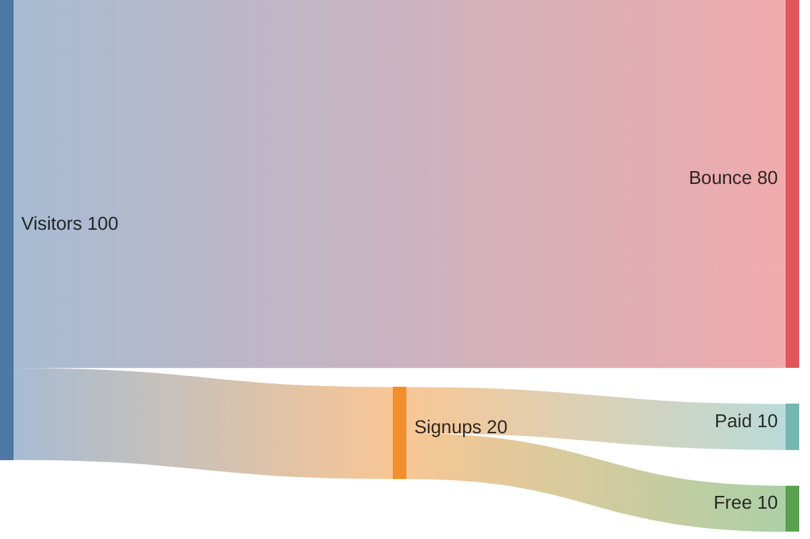
**Use for**: conversion funnels, energy/material flow, cost breakdown.

### XY chart (beta)
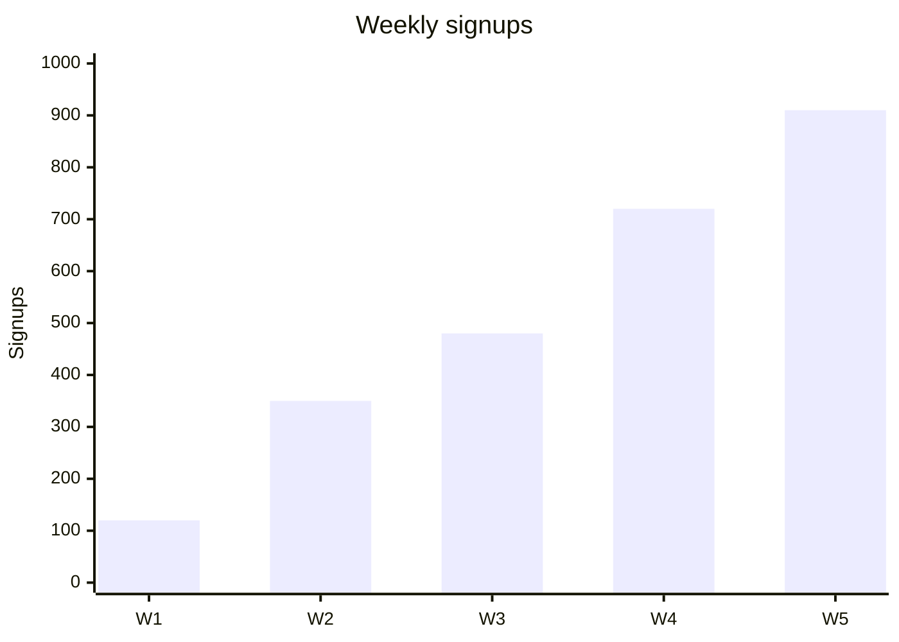
**Use for**: simple inline bar/line charts without generating an image.

### Block diagram (beta)
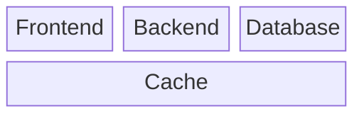
**Use for**: system composition, register layouts, memory maps.

### Architecture (beta)
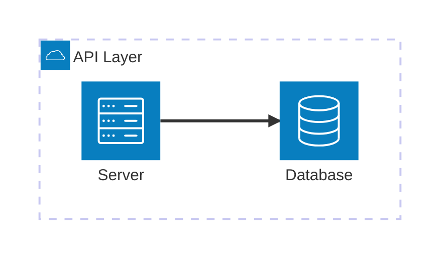
**Use for**: cloud/deployment architecture with service icons.

### Packet diagram (beta)
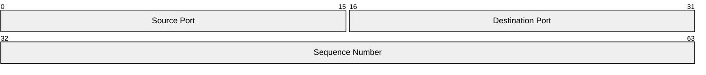
**Use for**: network protocol headers, binary layouts.

### Requirement diagram
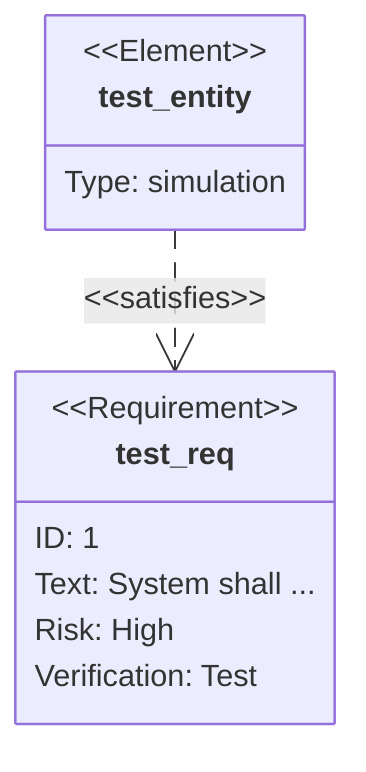
**Use for**: SysML-style requirements traceability.

---

## 2. PNG via scripts (for data mode)

The `scripts/make_chart.py` helper takes a CSV and produces themed PNG charts. See its `--help` for supported types:

- `bar` — vertical or horizontal bar chart
- `line` — time series or trend line
- `scatter` — correlation plots
- `histogram` — distribution shapes
- `box` — statistical box plots
- `heatmap` — matrix or calendar heatmap
- `pie` — share-of-whole (use Mermaid pie first; matplotlib pie only for multi-chart grids)

The script auto-themes to match your deck's theme palette when you pass `--theme <name>`.

Reference from a slide:

```markdown

```

---

## 3. HTML embeds (interactive, HTML output only)

Marp allows raw HTML in slides. These embed real interactive charts in the HTML output. They do NOT export to PPTX (the chart becomes a blank area). Use for HTML presentations only.

### Chart.js (simple, popular)
```markdown
<canvas id="chart1" width="600" height="400"></canvas>
<script src="https://cdn.jsdelivr.net/npm/chart.js"></script>
<script>
new Chart(document.getElementById('chart1'), {
  type: 'bar',
  data: { labels: ['A','B','C'], datasets: [{ data: [12, 19, 3] }] }
});
</script>
```

### ApexCharts / Highcharts / ECharts
Same pattern: `<div id="chart">` + `<script>` tag. Each has its own API.

**ECharts** is especially strong for: sankey, treemap, radar, gauge, candlestick, sunburst, graph.

### Plotly
```markdown
<div id="plot" style="width:600px;height:400px;"></div>
<script src="https://cdn.plot.ly/plotly-latest.min.js"></script>
<script>
Plotly.newPlot('plot', [{ x: [1,2,3], y: [2,6,3], type: 'scatter' }]);
</script>
```
**Strong for**: 3D plots, statistical charts, scientific visualization.

### D3.js (bespoke customs)
For flame graphs, force-directed networks, bespoke geometries, use D3 directly. Embed as `<svg>` + `<script>`.

### Flame graphs
Use [speedscope](https://www.speedscope.app/) to generate an interactive SVG, or use Brendan Gregg's flamegraph.pl to generate a standalone SVG. Embed as an image or iframe.

---

## 4. External imports (PNG/SVG)

Generate the diagram in another tool, export, import as image:

| Tool | Best for | Export |
|---|---|---|
| **Excalidraw** | Hand-drawn whiteboard feel | SVG |
| **draw.io / diagrams.net** | AWS/Azure/GCP icon-rich architecture | PNG, SVG |
| **tldraw** | Collaborative whiteboarding | SVG |
| **Figma** | Polished marketing/pitch visuals | PNG, SVG |
| **Lucidchart** | Enterprise diagrams | PNG, PDF |
| **D2** | Auto-layout DSL for big graphs | SVG |
| **Graphviz (DOT)** | Directed graphs with real layout engine | PNG, SVG |
| **PlantUML** | UML when Mermaid is too limited | PNG, SVG |
| **Speedscope** | Flame graphs from profiler traces | SVG |

Reference:

```markdown

```

---

## 5. ASCII diagrams

Fastest path when Mermaid is overkill. Wrap in a fenced block without a language:

```
+---------+     +-------+     +----+
| Client  | --> |  API  | --> | DB |
+---------+     +-------+     +----+
```

Also useful for trees:

```
my-app/
├── src/
│   ├── api/
│   └── ui/
├── test/
└── README.md
```

And for quick tables inside code-styled blocks.

---

## Which to pick

| Situation | Use |
|---|---|
| Explaining a pipeline | Mermaid `flowchart` |
| Explaining an API call | Mermaid `sequenceDiagram` |
| System architecture | Mermaid `C4Container` (or draw.io if you need icons) |
| Lifecycle / states | Mermaid `stateDiagram-v2` |
| Schema | Mermaid `erDiagram` |
| Roadmap | Mermaid `gantt` or `timeline` |
| Prioritization 2x2 | Mermaid `quadrantChart` |
| Conversion funnel | Mermaid `sankey-beta` |
| Real data chart (export-ready) | `make_chart.py` → PNG |
| Interactive exploration (HTML only) | ECharts / Plotly embed |
| Flame graph | Speedscope SVG |
| Network diagram (big) | D2 or Graphviz → SVG |
| Whiteboard sketch | Excalidraw → SVG |
| Quick box diagram | ASCII |
