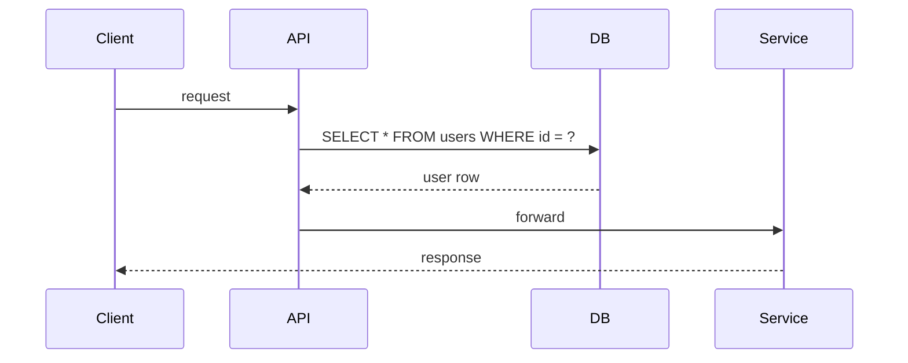
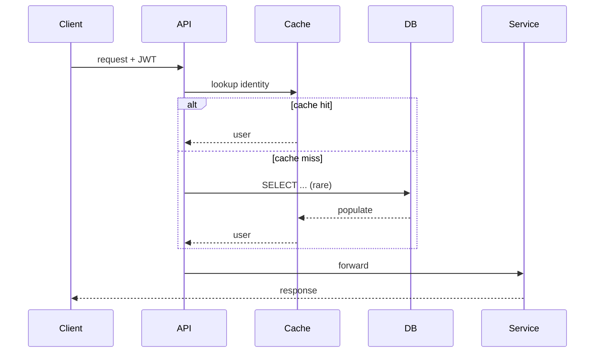

<!-- _class: lead -->

# We cut auth p99 latency from 480ms to 42ms

### Design review — auth rewrite

Dori Shacham · 2026-04-12

<!--
EXAMPLE — this is a golden-example deck for the technical-codebase mode.
Outline:
1. Title (finding in the title, not the topic)
2. Why we rewrote
3. The architecture (before/after)
4. The critical path (code walkthrough)
5. The caching trick
6. Failure modes
7. What we learned
8. Questions
-->

---

## Why we rewrote

The old middleware re-queried the user table on every request. Under load we saw p99 climb to 480ms. The rewrite moves user identity into a signed token, caches it locally, and touches the DB only on cache miss.

---

## Architecture — before



**Two DB round-trips per request.** Fine for 100 RPS. Not for 10k.

---

## Architecture — after



**One round-trip on the hot path.** DB touched <0.3% of requests.

---

## The critical path

```python
def authenticate(req):
    token = req.headers.get("authorization")      # middleware/auth.py:17
    claims = verify_jwt(token, PUBKEY)             # middleware/auth.py:22
    user = identity_cache.get(claims["sub"])       # middleware/auth.py:28
    if user is None:
        user = db.users.get(claims["sub"])         # middleware/auth.py:31
        identity_cache.set(claims["sub"], user, ttl=300)
    return user
```

Five lines. One DB query on miss. 300-second TTL balances freshness vs load.

---

## The caching trick

We use a **per-process LRU** (not Redis). Why:

- Process-local hit rate is >99% under steady traffic
- Zero network overhead (Redis would have been 1-2ms each call)
- Memory cost is ~80 bytes per entry × 10k entries × N pods ≈ negligible
- Invalidation: JWTs carry a short TTL; stale data naturally ages out

<!-- Walk through the trade-off: LRU vs Redis vs local SQLite. -->

---

## Failure modes

| Mode                  | Trigger                        | Mitigation                    |
|-----------------------|--------------------------------|-------------------------------|
| JWT verify fails      | key rotation not propagated    | dual-key verify window        |
| Cache cold after deploy | all pods restart             | warmup job hits top-100 users |
| Clock skew            | VM drift                       | 30s leeway in verify          |
| Token theft           | stolen device                  | refresh tokens + revocation   |

---

## What we learned

- **Measure the hot path first.** We almost optimized JSON parsing — it turned out to be 3% of the budget.
- **LRU beat Redis** for this workload. Don't assume distributed.
- **Dual-key rotation** should have been there from day one, not added after an outage.

---

<!-- _class: lead -->

# Questions?

auth.py · middleware/cache.py · design-doc/auth-rewrite.md
