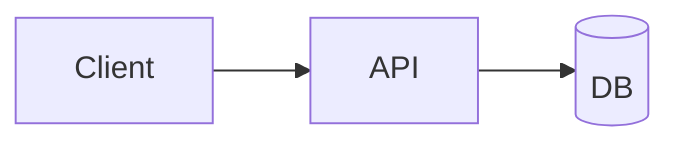

# Marp Syntax Cheatsheet

Quick reference for Marp Markdown. Read this whenever you forget syntax.

## Global directives (frontmatter)

```yaml
---
marp: true                      # REQUIRED
theme: midnight                 # one of the themes in themes/
paginate: true                  # show page numbers
header: "My Talk"               # top-of-slide text
footer: "dori@example.com"      # bottom-of-slide text
size: 16:9                      # aspect ratio (16:9, 4:3, or custom like 1280x720)
math: mathjax                   # enable LaTeX math (mathjax or katex)
backgroundColor: "#fff"         # global background
color: "#000"                   # global text color
style: |                        # inline CSS override
  section { font-family: 'Inter'; }
---
```

## Slide separator

Slides are separated by `---` on its own line (with blank lines around).

```markdown
# Slide 1

Content

---

# Slide 2

Content
```

## Local directives (per-slide)

Apply a directive to just the next slide with `<!-- _directive -->`:

```markdown
<!-- _class: lead -->
<!-- _backgroundColor: black -->
<!-- _color: white -->
<!-- _paginate: false -->

# This slide uses the directives above
```

Apply to this slide + all subsequent ones (without underscore):

```markdown
<!-- class: lead -->
```

## Classes

Marp themes define classes you invoke via `<!-- _class: ... -->`:

- `lead` — large centered hero slide (title slides)
- `invert` — flip to dark mode for one slide (some themes)

## Speaker notes

HTML comments that DO NOT start with an underscore or directive keyword become speaker notes:

```markdown
# My Slide

Visible content

<!-- Speaker note: walk the audience through X, then segue to Y -->
```

Speaker notes appear in the exported .pptx notes pane and in Marp's presenter mode.

## Code blocks

Fenced with triple backticks + language hint:

````markdown
```python
def handle(req):
    return 200
```
````

For long code, split across slides or shrink with `style:` overrides.

## Inline code

Backtick-wrapped: `like_this`.

## Math (requires `math: mathjax`)

Inline: `$x = 5$`

Display:

```markdown
$$
\mathcal{L} = \sum_{i} \ell(f(x_i), y_i)
$$
```

## Mermaid diagrams

Marp renders Mermaid code blocks natively:

````markdown

````

See `diagrams.md` for the full Mermaid catalog.

## Images

Basic:

```markdown

```

With sizing:

```markdown
    <!-- width + height in px -->
           <!-- percentage -->
```

Background images:

```markdown
                       <!-- fills slide background -->
                  <!-- half slide, left side -->
            <!-- right 40% of slide -->
     <!-- with blur filter -->
           <!-- semi-transparent -->
                 <!-- fill mode -->
               <!-- fit mode -->
```

Multiple backgrounds stack:

```markdown


```

With `![bg vertical]` or `![bg horizontal]` to control split direction.

## Columns (via inline CSS or split classes)

Split slide into columns with background images:

```markdown
# Title


- Point one
- Point two
- Point three
```

Or use inline HTML for more control:

```markdown
<div class="columns">
<div>

## Left column

Content

</div>
<div>

## Right column

Content

</div>
</div>
```

With CSS in the `style:` frontmatter:

```yaml
style: |
  .columns {
    display: grid;
    grid-template-columns: 1fr 1fr;
    gap: 2rem;
  }
```

## Paginate control

Disable pagination per-slide:

```markdown
<!-- _paginate: false -->

# Title slide
```

Or `hold` (show page number but don't count) or `skip` (hide from output):

```markdown
<!-- _paginate: hold -->
<!-- _paginate: skip -->
```

## Emoji

Standard Unicode emoji work. Some themes render them in color, some don't.

## HTML

Raw HTML works in Marp but only renders in HTML output (not PPTX):

```markdown
<div style="color: red;">Red text</div>
```

Use sparingly. HTML doesn't export to PPTX shapes.

## Footnotes

Basic Markdown footnotes work:

```markdown
This claim needs a source.[^1]

[^1]: Smith et al., 2023.
```

## Tables

Standard Markdown tables:

```markdown
| Column A | Column B | Column C |
|----------|----------|----------|
| cell 1   | cell 2   | cell 3   |
| cell 4   | cell 5   | cell 6   |
```

Alignment:

```markdown
| left | center | right |
|:-----|:------:|------:|
| a    |   b    |     c |
```

## Common gotchas

- **Don't put `---` inside a code block** — it will split the slide even inside backticks. Use `~~~` for the inner fence if needed.
- **Local directives must be on their own line**, not inline with other text.
- **Image paths are resolved relative to the .md file**, not the CWD.
- **Marp CLI needs `--allow-local-files`** to load local images in HTML output (for security).
- **Background images need `bg` in the alt text**, or they render as regular inline images.

## Rendering commands (reference)

From the CLI directly (the `render.py` script wraps these):

```bash
# HTML
npx @marp-team/marp-cli@latest deck.md -o deck.html

# PDF
npx @marp-team/marp-cli@latest deck.md --pdf -o deck.pdf

# PPTX (editable shapes)
npx @marp-team/marp-cli@latest deck.md --pptx -o deck.pptx

# PPTX (rendered images — looks exact but not editable)
npx @marp-team/marp-cli@latest deck.md --pptx --pptx-editable=false -o deck.pptx

# With custom theme set (directory)
npx @marp-team/marp-cli@latest deck.md --theme-set ./themes/ -o deck.html

# Live preview server
npx @marp-team/marp-cli@latest -s ./decks/

# Watch mode
npx @marp-team/marp-cli@latest -w deck.md

# Allow local images
npx @marp-team/marp-cli@latest deck.md --allow-local-files
```
