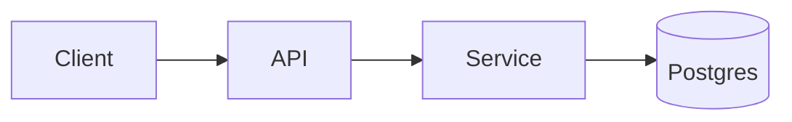

<!-- _class: lead -->

# {{TITLE}}

### {{SUBTITLE}}

{{AUTHOR}}

<!--
OUTLINE:
1. TL;DR
2. Architecture at a glance
3. The critical path (code walkthrough)
4. Failure modes
5. Takeaways
-->

---

## TL;DR

One paragraph: what this is, why it matters, what changed.

---

## Architecture at a glance



<!-- Walk the diagram top-to-bottom in speaker notes. -->

---

## The critical path

```python
def handle_request(req):
    user = authenticate(req)       # auth.py:42
    payload = validate(req.body)   # validators.py:17
    return process(user, payload)  # pipeline.py:88
```

Cite `file:line` for every claim. The audience should be able to jump straight to the code.

---

## Failure modes

| Mode     | Trigger     | Mitigation      |
|----------|-------------|-----------------|
| Timeout  | slow DB     | circuit breaker |
| Panic    | nil deref   | input validation|
| 429      | burst       | token bucket    |

---

## Takeaways

- One learning
- One open question
- One follow-up

---

<!-- _class: lead -->

# Questions?
